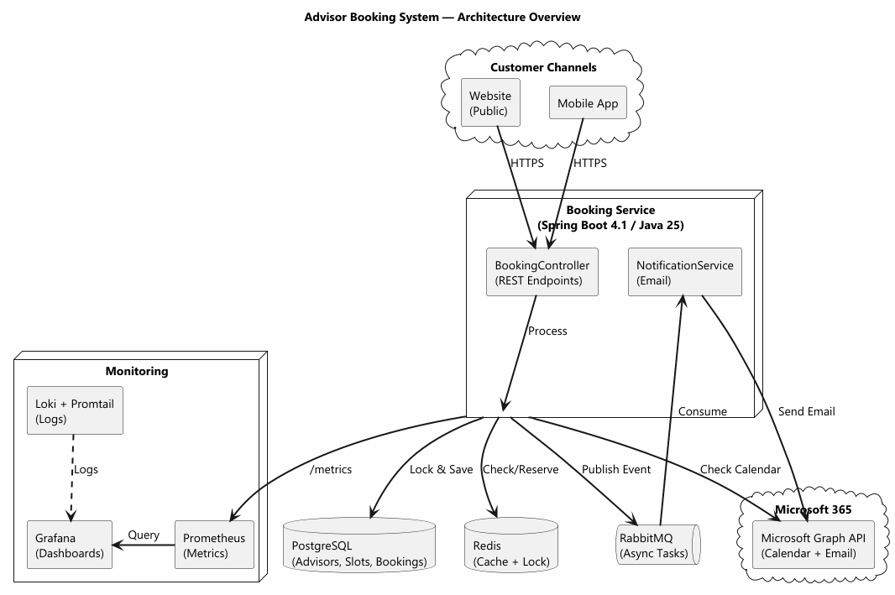
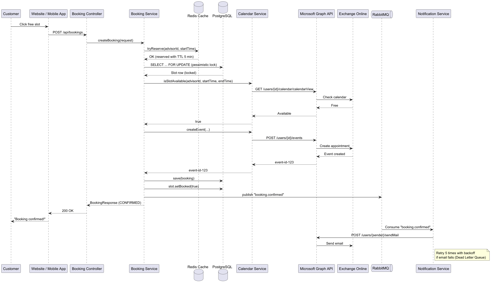
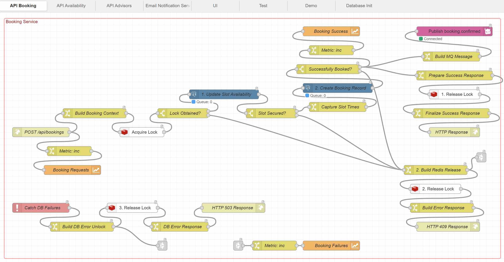
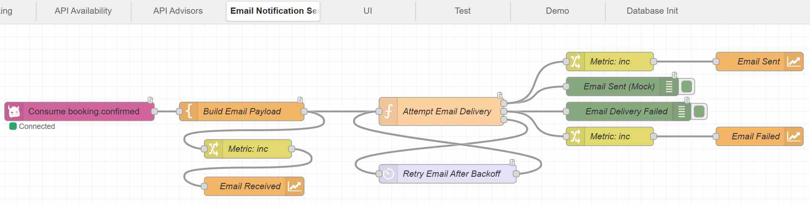

# Advisor Booking System

Short summary of the booking solution and the prototype in this repo.

## What this is

The assignment asks for a solution that lets customers book advisor meetings from a website or mobile app, stops double-booking, saves the booking, connects to Outlook/Exchange, and sends a confirmation email.

This repo has a working prototype and a short architecture note. Node-RED was used to prototype the system flow end to end. The prototype uses PostgreSQL, Redis, RabbitMQ, and a React UI. The target design is a modular Java/Spring Boot app.

## Solution overview

- **Architecture style:** modular monolith
- **Backend:** Java 25, Spring Boot 4.1
- **Storage:** PostgreSQL
- **Locking / short-lived state:** Redis
- **Async messaging:** RabbitMQ
- **Calendar and email:** Microsoft Graph API for Outlook / Exchange Online

Main Java components:

- `BookingController`
- `BookingService`
- `CalendarService`
- `NotificationService`
- `BookingRepository`
- `AvailabilityCacheService`
- `BookingEventPublisher`
- `BookingEventHandler`

### Architecture overview

### Booking flow

### Node-RED prototype

Node-RED was used to try the flow quickly before the Java version.

## Booking flow

1. Customer sends a booking request from the website or mobile app.
2. API layer sends the request to the booking service.
3. Redis reserves the slot for a short time.
4. PostgreSQL locks the slot row and stops parallel updates.
5. Microsoft Graph checks the advisor calendar and creates the event.
6. PostgreSQL saves the booking and marks the slot as booked.
7. RabbitMQ publishes a `booking.confirmed` event.
8. Email service reads the event and sends the confirmation email.

## Race conditions

Double-booking is stopped by using:

- Redis reservation for quick visibility
- PostgreSQL row locking for correctness
- a unique constraint as the final backup

If another customer comes too late, the API returns `409 Conflict`.

## Error handling

- **Calendar unavailable:** retry a few times, then reject the booking.
- **Database unavailable:** stop fast and show a maintenance error.
- **Email failure:** booking still succeeds; email is retried later.

## Scalability

500,000 bookings per month is a moderate load. The system can scale by:

- running more API instances behind a load balancer
- keeping PostgreSQL as the main source of truth
- using Redis for fast reads and short reservations
- using RabbitMQ for background email work
